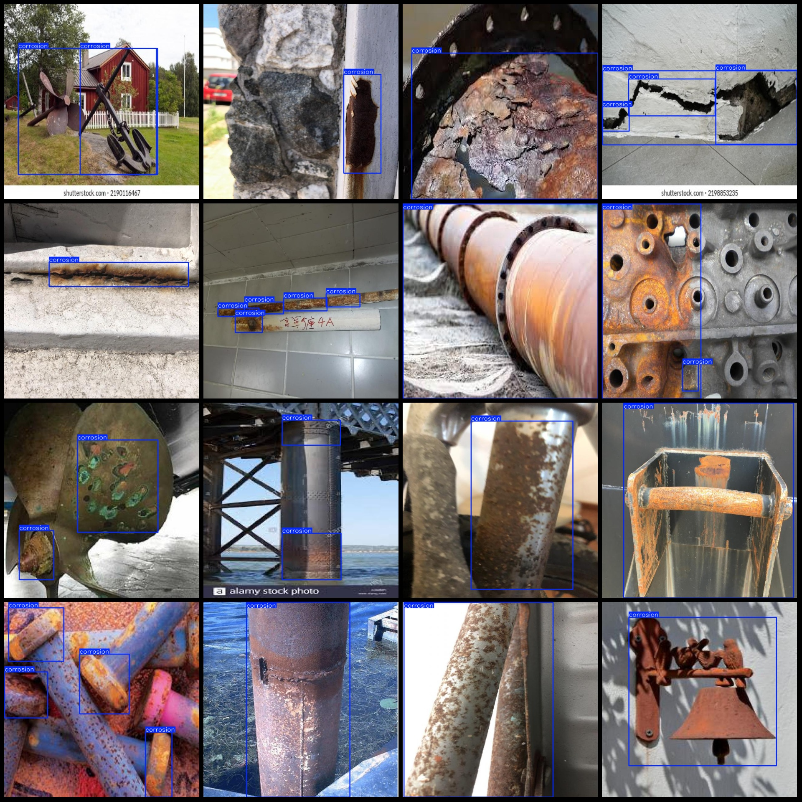
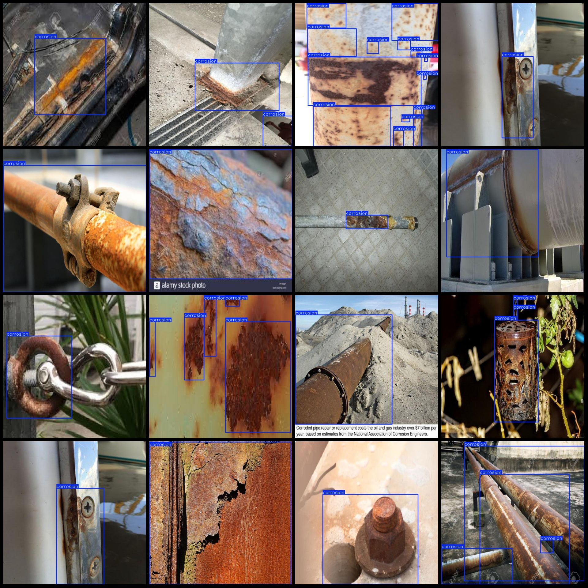

# Industrial Corrosion Detection Dataset: VOC+YOLO Format with 2822 Images in 1 Category

The dataset format includes both Pascal VOC and YOLO file formats (excluding the split path in the .txt file, only containing jpg images, along with corresponding VOC XML files and YOLO txt files). The number of images is 2822. There are 2822 .xml files for labels. There are also 2822 .txt files for labels. There is only one label category: "corrosion". The boxes for each category have been marked on the images.

- Number of images (jpg files): 2822
- Number of labels (xml files): 2822
- Number of labels (txt files): 2822
- Number of label categories: 1
- Label category name: ["corrosion"]
- Number of boxes for each category:
    - Boxes for "corrosion": 8665
- Total number of boxes: 8665
- Image resolution: 640x640
- Annotation tool used: labelImg
- Annotation rules applied: mark a box around the category.
- Important notes: None
- Special statement: No guarantees are made regarding the accuracy of the models trained on this dataset or the weights files.

**Notes on Annotation Examples:**
This dataset provides a comprehensive set of images to study the corrosion phenomenon in various industrial materials. Each image is labeled with a single "corrosion" category, indicating the presence or absence of corrosion within the area. The images are all 640x640 pixels in size, making them suitable for detailed inspection and analysis. This dataset can be useful for researchers and developers interested in developing machine learning models to detect corrosion in industrial settings.

## Images

Here is a pay link on Stripe ( https://buy.stripe.com/3cs8yP7sY87d0vu9AB ). Please contact me lonlonago@foxmail.com after funding $89, and I will send you a complete data files , thank you!

